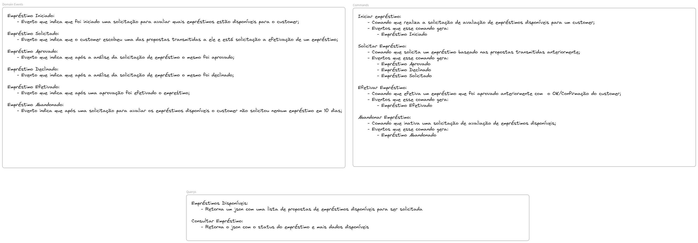

# Loan

## Description
This repository was created to learn the Kotlin language by implementing the challenge of creating a loan system.

## Challenge
[CHALLENGE](CHALLENGE.md)

## Event Storming


## Running the application in dev mode

You can run your application in dev mode that enables live coding using:
```shell script
docker-compose up -d
```

> **_NOTE:_**  Quarkus now ships with a Dev UI, which is available in dev mode only at http://localhost:8080/q/dev/.

## Packaging and running the application

The application can be packaged using:
```shell script
make build 
```


cd sh ./kafka-connect/source/send-kafka-connect-config.sh

Pegar os connectores disponíveis
curl -X GET http://localhost:8083/connectors

Verificar o status de um connector:
curl -X GET http://localhost:8083/connectors/jdbc-source-connector/status

Deletar o connector
curl -X DELETE http://localhost:8083/connectors/jdbc-source-connector

/connector-plugins/{connectorType}/config/validate

kafka-console-consumer --bootstrap-server kafka:9092 --topic outbox_event_outbox_event --from-beginning